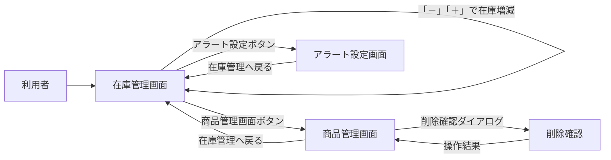

#  購買部プロジェクト
## 概要
研究室の購買部プロジェクトは、研究室の購買の在庫を管理するシステムを開発します。
このシステムは、在庫数の増減、商品の追加・削除ができるようにします。
## 想定ユーザー
- 研究室購買部の担当者およびメンバー。学内LANに接続した端末からアクセスし、ログイン不要で在庫管理を行う。
- Slack通知受信者はSlackチャンネルの購読者であり、アプリ操作は行わず通知のみを受信する。

## 機能要件
1.在庫表示機能
- 現在の在庫数を表示する機能
- 商品の情報（商品名、商品価格、商品在庫）を表示する機能
- 表品在庫の数の横「－」と「＋」を追加してそれをクリックすることで増減できる帰納
- 在庫数が0以下にならないようにする機能
2.商品種類追加・削除機能
- 新しい商品の追加機能（商品名、商品価格、初期在庫数を入力）
- 既存商品の削除機能
- 削除時に確認ダイアログを表示する機能
- 既存商品の情報（商品名、商品価格、商品在庫）を編集する機能
3.在庫アラート帰納
- 在庫数が一定の閾値（2個）以下になった場合にアラートを表示する機能
- アラートはSlackで通知する機能
- アラートの閾値を管理者が設定できる機能
- アラート履歴を表示する機能

## バリデーションと業務ルール
- 商品名: 1〜255文字のUTF-8文字列。重複登録禁止。
- 商品価格: 0以上の小数第2位まで。税別/税込の区別は価格フィールドに含める。
- 在庫数: 0以上の整数。`increase/decrease`はDBレベルの排他制御（楽観ロック）でアトミックに反映させ、0未満になる操作は`409 Conflict`で拒否。
- 商品削除: 在庫ゼロかつ未使用のイベントのみ削除可。削除時に確認ダイアログへ商品名・在庫・価格を表示。
- アラート閾値: 0〜999の整数。変更時は`inventory_events`に記録しSlackへ設定変更通知を送る。
- 入力フォームは必須項目をクライアント/サーバ両方でバリデーションし、エラー詳細をフィールド単位で返す。
- 操作担当者名: 在庫増減・商品CRUD・アラート設定変更を行う際は担当者名（1〜64文字）を必須入力とし、各APIで`operatorName`として受け渡し、`inventory_events`およびSlack通知に記録する。

## Slack通知仕様
- 通知手段: Slack Incoming Webhook URLを`SLACK_WEBHOOK_URL`環境変数に安全に格納し、KMSで暗号化。Webhookへの通信はTLS1.2以上。
- チャンネル: `#lab-inventory-alert`を既定とし、設定で変更可能。通知内容は商品名、現在庫、閾値、発生日時、操作ユーザー、requestIdを含むJSON。
- トリガー: 在庫が閾値以下に到達した時と閾値変更時。連続アラートを防ぐため、同一商品について5分以内の重複通知を抑制。
- リトライ: Slack APIが`5xx`やタイムアウトを返した場合は指数バックオフで最大3回再送。すべて失敗した場合は`alert_history`に失敗ステータスを記録し、管理者ダッシュボードで可視化。

## 非機能要件
- 可用性: 99.5%以上/月。アプリは冗長化されたアプリケーションサーバで稼働させ、DBは1時間毎のスナップショットを取得。
- 性能: 同時ユーザー30人、在庫一覧取得は500件を1秒以内、在庫更新は300ms以内を目標。Slack通知は閾値到達から10秒以内に送信。
- セキュリティ: HTTPS + クライアント証明書(mTLS)を必須化し、研究室管理端末のみがアクセスできる閉域ネットワークで運用する。更新系APIは更に物理カードに格納された`X-Operator-Token`をヘッダー送信した場合のみ受け付け、全操作は`inventory_events`で監査可能にする。
- ロギング/監視: structured logging(JSON)を採用し、requestIdで相関。メトリクスはPrometheus形式でエクスポートし、在庫変動エラーやSlack連携失敗はアラート閾値設定。
- バックアップ/リストア: DB dumpを1日1回S3互換ストレージに保管。保持期間90日。復旧手順をrunbook化。

## 運用・デプロイ要件
- 環境: `dev`(H2), `stg`(PostgreSQL), `prod`(PostgreSQL)の3系統。環境変数とSecrets Managerで設定を切り替える。
- Docker: Spring Bootイメージをマルチステージでビルドし、Vaadinのフロント資産を`npm run build`後に組み込む。HelmチャートでKubernetesにデプロイし、ローリングアップデートを実施。
- CI/CD: GitHub ActionsでPR毎にビルド・テスト・SCAを実行し、`main`へのマージでstgデプロイ、タグ作成でprodデプロイを自動化。
- 監視: CloudWatch/Prometheusでメトリクスとログを集約し、Slack通知失敗やエラー率上昇時にオンコールへPagerDuty連携。

## 品質保証
- テスト: 単体(JUnit+Mockito)、結合(Spring Boot Test)、E2E(Playwright+Vaadin TestBench)を整備し、Slack Webhookはモックサーバで検証。負荷試験はk6で閾値を満たすこと。
- リリース判定: テスト成功、セキュリティスキャン(Snyk)クリア、手動探索テスト、runbook更新、ステークホルダー承認を必須チェックリスト化。

# 画面構成
1.在庫管理画面
- 在庫表示機能
- 「－」「＋」ボタンで在庫の増減機能
- 商品種類追加・削除ができるページへ移動するボタン
- アラート設定画面へ移動するボタン
2.商品管理画面
- 新しい商品の追加フォーム
- 既存商品の削除ボタン
- 既存商品の情報編集フォーム
- 在庫管理画面へ戻るボタン
3.アラート設定画面
- アラート閾値設定フォーム
- アラート履歴表示セクション
- 在庫管理画面へ戻るボタン
- 在庫管理画面へ戻るボタン
## mermaid記法による画面遷移図

# 技術要件
- フロントエンド: Java(vaadin)
- バックエンド: Java(Spring Boot)
- データベース: H2 Database
- 通知サービス: Slack API
- バージョン管理: Git
- デプロイメント: Docker(開発環境が整っていないためコメントアウトで実装、本番環境で有効化予定)
# DB設計
## テーブル: products
| カラム名       | データ型     | 制約               | 説明               |
|----------------|--------------|--------------------|--------------------|
| id             | INT          | PRIMARY KEY        | 商品ID             |
| name           | VARCHAR(255) | NOT NULL           | 商品名             |
| price          | DECIMAL(10,2)| NOT NULL           | 商品価格
| stock_quantity | INT          | NOT NULL           | 商品在庫数         |
## テーブル: alert_settings
| カラム名       | データ型     | 制約               | 説明
|----------------|--------------|--------------------|--------------------|
| id             | INT          | PRIMARY KEY        | 設定ID             |
| threshold      | INT          | NOT NULL           | アラート閾値       |
## テーブル: alert_history
| カラム名       | データ型     | 制約               | 説明
|----------------|--------------|--------------------|--------------------|
| id             | INT          | PRIMARY KEY        | 履歴ID             |
| product_id     | INT          | FOREIGN KEY        | 商品ID             |
| alert_time     | TIMESTAMP    | NOT NULL           | アラート発生
 時間               |
| message        | VARCHAR(255) | NOT NULL           | アラートメッセージ |
## テーブル: inventory_events
| カラム名       | データ型     | 制約               | 説明               |
|----------------|--------------|--------------------|--------------------|
| id             | BIGINT       | PRIMARY KEY        | イベントID         |
| product_id     | INT          | FOREIGN KEY        | 対象商品ID         |
| operator_name  | VARCHAR(64)  | NOT NULL           | 操作担当者名       |
| event_type     | VARCHAR(32)  | NOT NULL           | 種別(add/remove/update/alert)|
| delta          | INT          |                    | 在庫変動量（増減時のみ）|
| snapshot_stock | INT          | NOT NULL           | 変動後在庫数       |
| request_id     | VARCHAR(64)  |                    | リクエスト識別子   |
| metadata       | JSON         |                    | 備考（Slackレスポンス等）|
| created_at     | TIMESTAMP    | NOT NULL           | 発生日時           |
## リレーションシップ
 - products.id 1 --- N alert_history.product_id
 - products.id 1 --- N inventory_events.product_id
## インデックス
 - products.name (商品名にインデックスを作成し、検索性能を 向上させる)
 - alert_history.alert_time (アラート発生時間にインデックスを作 成し、履歴の検索性能を向上させる)
 - inventory_events.created_at (監査ログの時系列検索を高速化)
 - inventory_events.operator_name (担当者別検索用)
# API設計
## エンドポイント一覧
### 共通仕様
- すべてのAPIはHTTPS経由で提供し、学内LAN/VPNからのアクセスに限定する。CSRF対策トークンを付与したフォーム送信のみを受け付ける。
- クライアント接続は必ずmTLSで確立し、更新系エンドポイント（POST/PUT/DELETE）は`X-Operator-Token`ヘッダーに登録済み物理カード由来のトークンが含まれている場合のみ受理する。
- リクエスト/レスポンスは`application/json`。成功時は`200`/`201`、バリデーションエラーは`400`、認証失敗は`401`、権限不足は`403`、存在しないリソースは`404`、整合性エラーや在庫不足は`409`、サーバ障害は`500`で返す。
- 全APIで`requestId`ヘッダーを受け付け、レスポンスにもエコーし`inventory_events.metadata`に保存してトレーサビリティを担保する。
- 操作権限はネットワークセグメントとCSRFトークンにより担保し、各操作で`operatorName`を必須入力して監査ログに残す。
### 認証API
- （削除）ログイン/ログアウト/トークン更新APIは提供しない。
### 在庫管理API
1.在庫管理API
- GET /api/products
  - 説明: すべての商品在庫情報を取得する。閲覧用途の端末から自由に利用できる。
  - クエリ: `?keywords=`、`?page=`、`?size=`で検索とページングに対応。
  - レスポンス: 商品リスト（商品ID、商品名、商品価格、商品在庫数、最終更新日時）。500件までは1レスポンスで返却し、以降はページング。
- POST /api/products/{id}/increase
  - 説明: 指定した商品の在庫数を増加させる。操作担当者名の入力とCSRFトークンが必須。
  - パスパラメータ: id (商品ID)
  - リクエストボディ: `{"delta": 数値}`（1〜1000）。
  - バリデーション: `delta`が正整数であること、商品が存在することを確認。
  - レスポンス: 更新後の商品情報。`inventory_events`に操作を記録。
- POST /api/products/{id}/decrease
  - 説明: 指定した商品の在庫数を減少させる。操作担当者名の入力とCSRFトークンが必須。
  - パスパラメータ: id (商品ID)
  - リクエストボディ: `{"delta": 数値}`（1〜1000）。
  - バリデーション: 在庫が`delta`以上あること。0未満になる場合は`409 Conflict`。
  - レスポンス: 更新後の商品情報。閾値以下になった場合はSlack通知とアラート履歴登録を行う。
